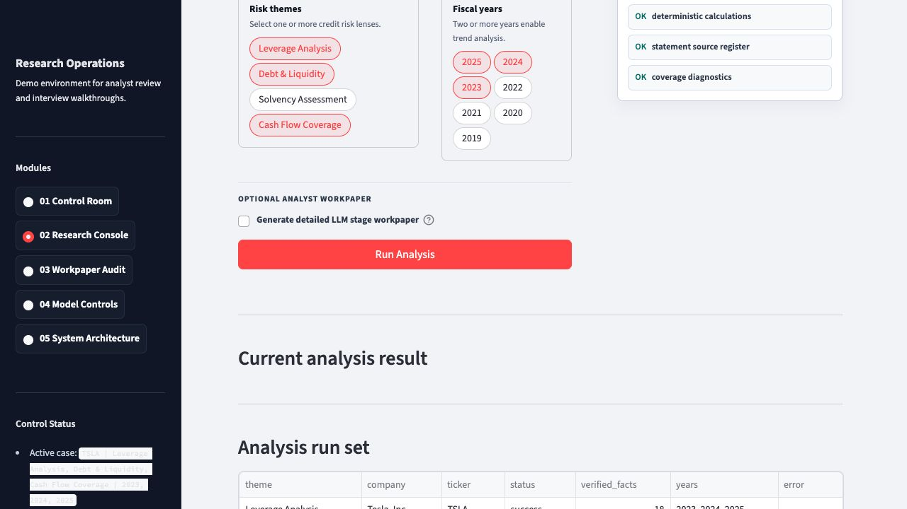

# Verified Credit Research Agent

LLM-driven credit research workbench for SEC filing analysis, with statement-first financial fact extraction, deterministic numeric verification, and auditable workpaper traces.

This project is designed to show what a production-minded financial research agent should look like when the domain is high-stakes: the LLM can plan, rewrite queries, synthesize, and critique, but financial numbers must come from deterministic SEC-data pipelines and verified calculations.

> Demo focus: debt, liquidity, leverage, solvency, and cash-flow coverage analysis over U.S. public company SEC filings.


## Why This Is Not A Normal RAG Bot

Ordinary RAG retrieves text and summarizes it. That is not enough for credit research because a credible analyst memo needs source discipline, numeric consistency, and a review trail.

This system separates responsibilities:

- **LLM layer:** research planning, ReAct loop steering, query rewriting, synthesis, semantic critique, and optional analyst-style workpaper notes.
- **Deterministic Python layer:** SEC retrieval, statement table extraction, XBRL/companyfacts cross-checking, calculations, numeric verification, guardrails, and trace persistence.
- **Audit layer:** evidence tables, source registers, tool traces, guardrail outputs, critic reports, and final briefs.

The LLM is not allowed to invent or calculate financial numbers. Unsupported numeric claims are blocked, repaired, or excluded.

## Current Capabilities

### Statement-First SEC Data Entrance

The newest data path reads the actual 10-K filing package before falling back to SEC companyfacts:

```text
SEC 10-K HTML / inline XBRL
-> Statement Table Extractor
-> Statement Row Normalizer
-> Statement Metric Resolver
-> Companyfacts Cross-check / Fallback
-> Deterministic Verification
-> Brief / Workpaper / UI
```

The statement layer extracts:

- consolidated balance sheet rows
- consolidated statement of operations / income rows
- consolidated cash flow statement rows
- row labels, normalized labels, fiscal years, values, units, XBRL concepts, filing URLs, and accession numbers

It currently resolves metrics such as:

- operating cash flow
- capital expenditures
- free cash flow from verified inputs
- dividend payments when explicitly disclosed
- interest expense when statement-confirmed
- current debt components
- long-term debt
- total debt from verified current + long-term debt
- cash and cash equivalents

Companyfacts remains useful, but it is now a cross-check and fallback rather than the only source.

### Agentic SEC Research Harness

The original Ford demo includes:

- section-aware filing ingestion
- BM25 + dense vector retrieval
- reciprocal rank fusion
- reranking
- evidence sufficiency checks
- query rewrite and re-retrieval
- cited final answer
- trace logs and workpaper artifacts

### LLM ReAct + Guardrails

M3 adds a real Bedrock Claude tool-calling loop:

- tool wrapping for deterministic retrieval and verification
- LLM query rewrite
- LLM synthesis bounded by verified facts
- numeric guardrail repair
- dual critic: deterministic numeric guardrail + LLM semantic critic
- trace entries with `reasoning_summary` and `decision_basis`, not raw chain-of-thought

### Streamlit Analyst Workbench

The UI provides:

- operating dashboard
- live Research Console
- statement source register
- verified fact register
- coverage diagnostics
- final credit brief
- workpaper audit
- model controls / guardrail views
- architecture walkthrough



## Demo Scenario

The recommended live demo is:

```text
Company: Tesla
Ticker: TSLA
Years: 2023, 2024, 2025
Themes:
- Leverage Analysis
- Debt & Liquidity
- Cash Flow Coverage
```

Why Tesla works well:

- widely recognized issuer
- real public-company SEC filings
- balance sheet, income statement, and cash-flow metrics are meaningful for credit discussion
- clean demonstration of ticker/name resolution, statement extraction, verified facts, and coverage diagnostics


## Architecture

```text
User Question
-> Task Spec Parser
-> Memory Reader
-> Skill Loader
-> LLM Planner / ReAct Loop
-> Tool Layer
-> Hybrid Retrieval / Reranking
-> Statement Table Extraction
-> Numeric Verification
-> LLM Synthesizer
-> Numeric Guardrail
-> Dual Critic
-> Workpaper Trace
-> Final Credit Research Brief
```


See [docs/architecture.md](docs/architecture.md) for a concise architecture summary.

## Milestone Evolution

| Milestone | What Changed |
|---|---|
| M1 | Rule-based agentic retrieval loop over Ford SEC filings |
| M2 | Deterministic numeric verification, research memory, debt/liquidity skill, evaluation metrics |
| M3 | Bedrock Claude ReAct tool calling, LLM query rewrite, guarded synthesis, dual critic |
| M4 | Streamlit demo UI and minimal read-only MCP server |
| M5 | Universal SEC company lookup and companyfacts-based structured analysis |
| M7 | Statement-first 10-K table extraction with companyfacts cross-check/fallback |

## Selected Validation Results

Recent live SEC checks targeted companies that exposed data-entrance problems:

| Ticker | Theme | Result |
|---|---|---|
| NVDA | `cash_flow_coverage` | OCF, capex, dividends, and FCF resolved from statement rows / verified inputs |
| AMZN | `cash_flow_coverage` | Capex resolved from cash flow statement; FCF calculated from verified OCF and capex |
| HD | `cash_flow_coverage` | Fiscal-year/report-date mapping fixed; 2025 capex resolved from statement rows |
| WMT | `leverage_analysis` | Interest expense resolved from income statement; debt components resolved from balance sheet |
| KO | `debt_liquidity` | Balance sheet detection fixed; current debt components, long-term debt, cash, and calculated total debt resolved |
| TSLA | multi-theme UI demo | Live statement-first workflow runs through Research Console and populates workpaper views |

## Quickstart

### 1. Clone and Install

```bash
git clone https://github.com/<your-username>/verified-credit-research-agent.git
cd verified-credit-research-agent
python3 -m venv .venv
source .venv/bin/activate
pip install -e .
```

### 2. Configure Environment

Copy the example environment file:

```bash
cp .env.example .env
```

Set a SEC-compliant user agent:

```bash
SEC_USER_AGENT="Your Name your.email@example.com"
```

Bedrock credentials are only needed for LLM workpaper / ReAct demo paths. The live deterministic Research Console can run without Bedrock.

### 3. Run The UI

```bash
streamlit run streamlit_app.py
```

Open the Research Console and run the Tesla demo or type any SEC-covered U.S. public company name/ticker.

## Demo Walkthrough

See [docs/demo_walkthrough.md](docs/demo_walkthrough.md) for the screenshot-backed walkthrough.

Recommended screenshots:

1. Research Console request setup
2. Tesla multi-theme analysis results
3. Statement source register
4. Workpaper audit
5. Model controls / guardrail view
6. System architecture

## MCP Server

M4.3 adds a real, minimal MCP server as a post-M3 integration layer. It is read-only and currently supports the Ford demo scope.

```bash
python3 -m credit_research_agent.mcp.server
```

Exposed tools:

- `hybrid_retrieve`
- `verify_numeric_claim`

See [docs/mcp.md](docs/mcp.md) for tool schemas and usage.

## Repository Layout

```text
configs/                         Metric mappings, company presets, risk themes
docs/                            Architecture, UI, MCP, demo walkthrough
docs/assets/                     README/demo screenshots
examples/                        Published demo artifacts and smoke outputs
scripts/                         Demo and validation entrypoints
skills/                          Debt/liquidity research skill
src/credit_research_agent/       Main Python package
tests/                           Unit and integration tests
streamlit_app.py                 Analyst workbench UI
```

Raw local run workspaces are intentionally excluded from GitHub. Published demo artifacts live under `examples/`.

## Verification

Run the test suite:

```bash
python3 -m unittest discover tests
```

Current full suite:

```text
Ran 164 tests
OK (skipped=14)
```

Skipped tests are live SEC integration checks that require network access to `sec.gov`.

## Known Limitations

- This is a research/demo workbench, not a production credit rating system.
- Coverage depends on SEC filing availability and table structure.
- Statement extraction focuses on the three primary financial statements. Some note-only disclosures require future specialized note extractors.
- `available_liquidity` and `total_debt_service` are not forced when no safe statement/companyfacts source exists.
- The MCP server is intentionally minimal and read-only.
- Live SEC paths require network access and a SEC-compliant user agent.

## Not Financial Advice

This project is for engineering and research demonstration only. It is not financial advice, investment advice, credit rating advice, or a recommendation to buy, sell, hold, lend to, or transact in any security or issuer.
