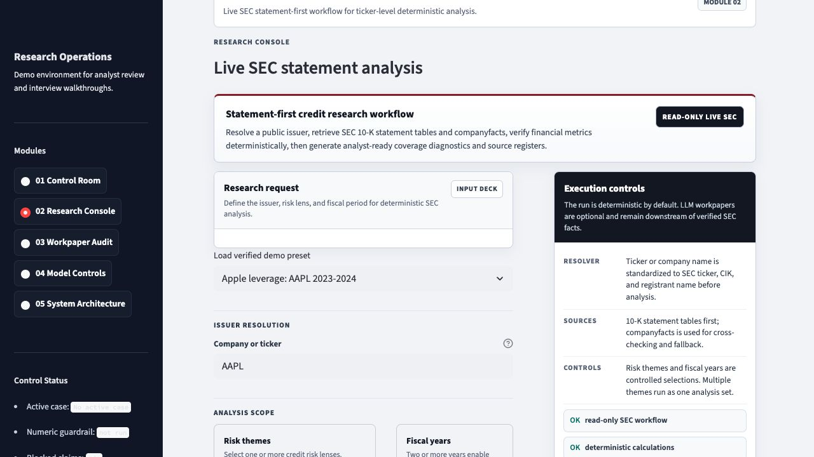
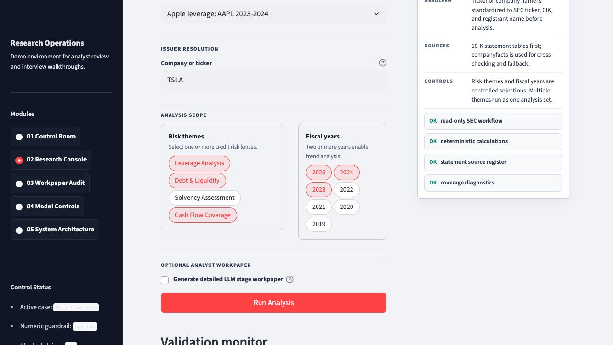
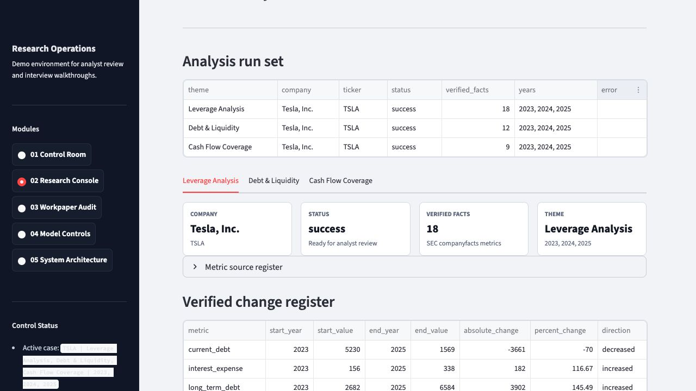
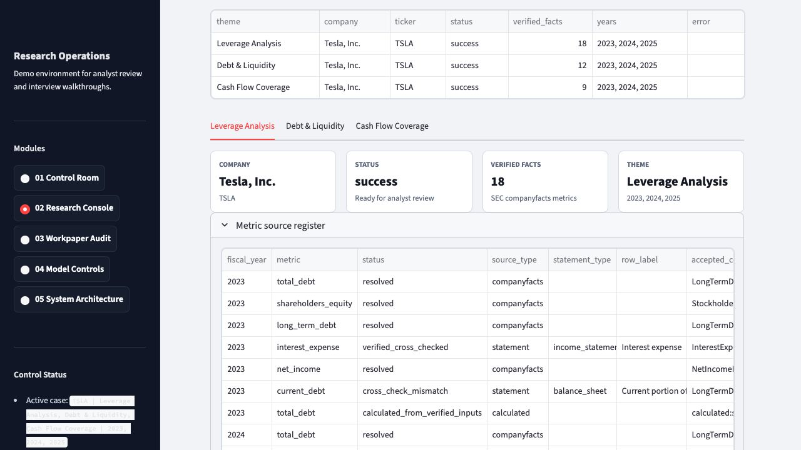
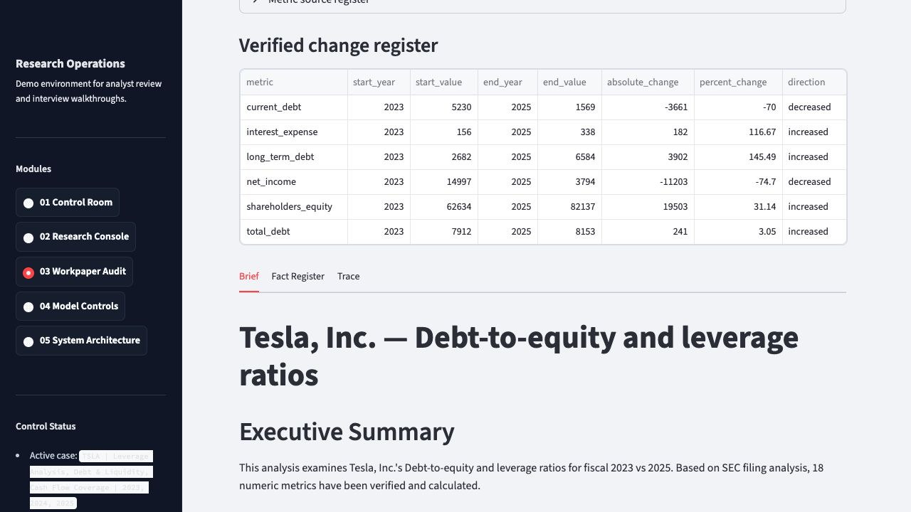
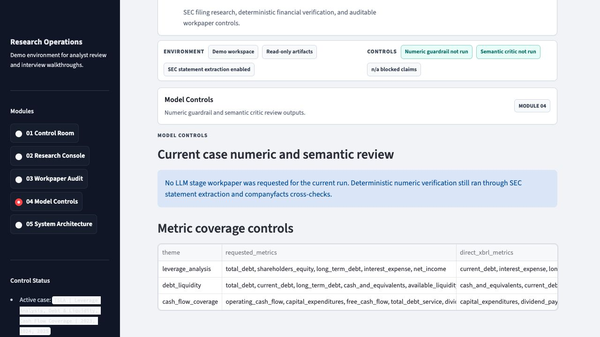
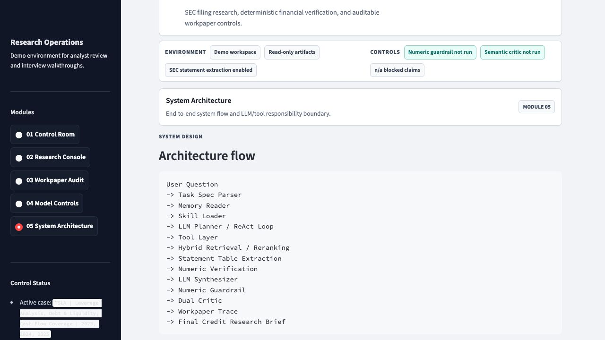

# Demo Walkthrough

This walkthrough shows the recommended GitHub/interview demo path for the Verified Credit Research Agent.

## Demo Case

```text
Company: Tesla
Ticker: TSLA
Years: 2023, 2024, 2025
Themes:
- Leverage Analysis
- Debt & Liquidity
- Cash Flow Coverage
```

Tesla is a useful public demo issuer because it is well known, has SEC filings available through EDGAR, and produces a mixed credit story across leverage, debt/liquidity, and cash-flow metrics.

## 1. Configure The Research Request

Open the Streamlit workbench:

```bash
streamlit run streamlit_app.py
```

Go to **Research Console**, type `TSLA`, select the risk themes, and select fiscal years `2023`, `2024`, and `2025`.



After configuration:



## 2. Run Statement-First Analysis

Click **Run Analysis**. The workbench resolves the issuer, retrieves SEC 10-K filings and companyfacts, extracts financial statement rows, resolves metrics, calculates verified deltas, and renders a grouped analysis set.



## 3. Inspect Source Discipline

Open **Metric source register** to review each metric's provenance.

The source register shows:

- fiscal year
- metric name
- status
- source type: statement, companyfacts, or calculated
- statement type
- row label
- XBRL concept
- value
- companyfacts cross-check status



This is the key control surface: the analyst can see whether a number came from the statement table, from companyfacts, or from a deterministic calculation.

## 4. Review The Workpaper

Open **Workpaper Audit** to inspect the current case workpaper. The brief summarizes verified changes and separates supported metrics from limitations.



## 5. Review Model Controls

Open **Model Controls** to confirm whether an optional LLM stage workpaper was requested and to inspect metric coverage controls.



## 6. Explain The Architecture

Open **System Architecture** to show the neurosymbolic boundary.



## Analyst Talking Points

- The system is not a generic filing chatbot.
- It uses LLM reasoning where language judgment is valuable.
- It uses deterministic Python for financial facts, calculations, verification, and guardrails.
- It reads SEC statement tables before relying on companyfacts.
- It explicitly records statement rows, XBRL concepts, cross-check status, and trace decisions.
- It avoids unsupported conclusions when source coverage is incomplete.

## Recommended Interview Summary

> I built a credit research workbench that combines an LLM-driven agent loop with deterministic SEC financial verification. The agent can plan, retrieve, synthesize, and critique, but numeric credit conclusions must pass through statement-table extraction, XBRL/companyfacts cross-checking, deterministic calculations, and guardrails. The UI exposes the workpaper trail so a reviewer can see exactly where the numbers came from.
