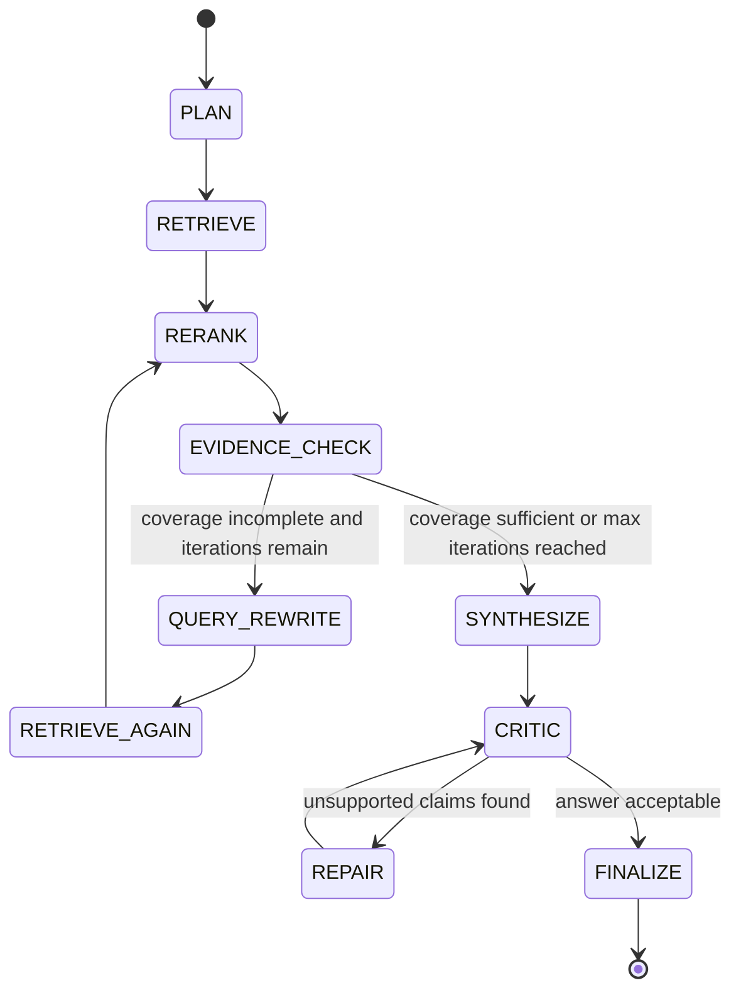

# Verified Credit Research Agent

## Milestone 1 Technical Design

Status: review draft  
Milestone boundary: design only, no implementation code

### Scope

Milestone 1 builds a narrow, runnable agentic retrieval loop for one demo question:

> How did Ford's debt and liquidity risk change from 2023 to 2025, and what evidence supports the change?

This milestone is not a general SEC chatbot. It supports only Ford debt/liquidity research over selected 2023 and 2025 SEC filings, with workpaper-style traceability.

Milestone 1 includes:

- SEC filing ingestion for Ford 2023 and 2025 filings
- Section-aware chunking
- BM25 retrieval
- Dense vector retrieval
- Reciprocal Rank Fusion
- Reranking
- Evidence sufficiency checks
- Query rewrite and re-retrieval
- Final cited answer
- `trace_log.json`

Milestone 1 excludes:

- Deterministic numeric verification
- Research memory
- Reusable skill files
- MCP server
- Multi-company support
- Multiple risk themes
- Streamlit UI
- General chat interface

Numeric values may appear in cited evidence, but the system must not present derived calculations or verified numeric claims until Milestone 2 adds deterministic verification.

### Design Principles

- Build one complete Ford debt/liquidity workflow before generalizing.
- Keep every agent decision auditable through JSON workpapers.
- Keep LLM usage optional and isolated behind interfaces; deterministic Python owns retrieval, scoring, coverage checks, trace writing, and citation checks.
- Treat any unavailable 2025 10-K as a filing substitution problem, not a reason to silently change the question.
- Prefer simple, testable heuristics in Milestone 1 over broad agent abstractions.
- Do not claim numeric verification in Milestone 1. The answer may cite disclosed numbers, but it must not calculate changes or ratios as final facts.
- Use local `numpy` brute-force cosine similarity for vector retrieval in Milestone 1. The corpus is small, and this avoids a FAISS dependency until scale requires it.

---

## 1. File Structure

```text
verified-credit-research-agent/
  README.md
  pyproject.toml
  .env.example

  data/
    raw/
      sec/
        ford/
          2023/
            filing.html
            filing_metadata.json
          2025/
            filing.html
            filing_metadata.json
    processed/
      ford_2023_2025_chunks.jsonl
      ford_2023_2025_embeddings.npy
      ford_2023_2025_vector_index/

  runs/
    ford_debt_liquidity_2023_2025/
      task.md
      task_spec.json
      plan.json
      retrieved_chunks.json
      reranked_chunks.json
      evidence_table.json
      evidence_coverage.json
      query_rewrites.json
      critic_report.json
      trace_log.json
      final_answer.md

  src/
    credit_research_agent/
      __init__.py

      config.py
      schemas.py

      ingestion/
        sec_fetcher.py
        filing_parser.py
        section_chunker.py

      retrieval/
        bm25_index.py
        vector_index.py
        dense_embedder.py
        rrf.py
        hybrid_retriever.py
        reranker.py

      agent/
        task_parser.py
        planner.py
        loop_controller.py
        evidence_checker.py
        query_rewriter.py
        synthesizer.py
        critic.py

      workpapers/
        run_workspace.py
        trace_logger.py

  scripts/
    ingest_ford_filings.py
    run_ford_demo.py
    inspect_trace.py

  tests/
    test_task_parser.py
    test_section_chunker.py
    test_rrf.py
    test_evidence_checker.py
    test_trace_logger.py
```

### Notes

- `scripts/ingest_ford_filings.py` is run before the demo to download or load filings and create chunks/indexes.
- `scripts/run_ford_demo.py` executes the single Milestone 1 workflow.
- `scripts/inspect_trace.py` is optional but useful for printing the trace summary during review.
- `runs/ford_debt_liquidity_2023_2025/` is overwritten or timestamped per run depending on CLI flag.
- `data/raw/` keeps original filings for auditability.
- `data/processed/` keeps generated chunks and retrieval indexes.
- `data/processed/` artifacts must be reproducible from `data/raw/` and configuration.

---

## 2. Component Interfaces

### 2.1 Task Spec Parser

Module: `agent/task_parser.py`

```python
def parse_task(question: str) -> TaskSpec:
    ...
```

Responsibility:

- Convert the fixed demo question into a structured task.
- Do not call an LLM in Milestone 1 unless needed; a rule-based parser is enough for the demo.
- Fail closed if the question does not match the supported Ford debt/liquidity use case.

Input:

```text
How did Ford's debt and liquidity risk change from 2023 to 2025, and what evidence supports the change?
```

Output: `TaskSpec`

```json
{
  "company": "Ford Motor Company",
  "ticker": "F",
  "cik": "0000037996",
  "years": [2023, 2025],
  "filing_types": ["10-K"],
  "risk_theme": "debt_liquidity",
  "question": "How did Ford's debt and liquidity risk change from 2023 to 2025, and what evidence supports the change?",
  "required_evidence": [
    "2023 debt evidence",
    "2025 debt evidence",
    "2023 liquidity evidence",
    "2025 liquidity evidence",
    "management explanation",
    "numeric facts"
  ]
}
```

### 2.2 SEC Fetcher

Module: `ingestion/sec_fetcher.py`

```python
def fetch_company_filing(
    cik: str,
    fiscal_year: int,
    filing_type: str
) -> FilingDocument:
    ...
```

Responsibility:

- Locate Ford filing for requested year and type.
- Save raw filing HTML and metadata.
- If 2025 10-K is unavailable, select latest available 10-K or 10-Q and record substitution in metadata.

Milestone 1 behavior:

- Prefer pre-downloaded filings if present.
- If live SEC retrieval is used, include SEC-compliant user agent in config.
- Record source URL, accession number, filing date, fiscal year, and filing type.
- Verify whether a fiscal 2025 Ford 10-K exists at runtime.
- If no fiscal 2025 10-K is available, select the latest available Ford annual or quarterly filing and set `is_substitution = true`.

Non-goal:

- Do not build a generic filing search UI or multi-company downloader.

### 2.3 Section Parser and Chunker

Module: `ingestion/filing_parser.py`, `ingestion/section_chunker.py`

```python
def parse_sections(filing: FilingDocument) -> list[FilingSection]:
    ...

def chunk_sections(
    sections: list[FilingSection],
    max_tokens: int = 650,
    overlap_tokens: int = 80
) -> list[FilingChunk]:
    ...
```

Responsibility:

- Convert filing HTML into text sections.
- Preserve section metadata.
- Prefer relevant sections:
  - MD&A
  - Liquidity and Capital Resources
  - Debt notes
  - Risk Factors
  - Credit facilities
  - Long-term debt
  - Cash flow discussion

Simplification:

- Use heading-based heuristics for Milestone 1.
- If a section cannot be perfectly isolated, keep broad item-level sections and mark `section_name` with the best available heading.
- Preserve table-adjacent text as text. Perfect table extraction is deferred to Milestone 2 numeric verification.

### 2.4 BM25 Index

Module: `retrieval/bm25_index.py`

```python
class BM25Index:
    def build(self, chunks: list[FilingChunk]) -> None: ...
    def search(self, query: str, top_n: int) -> list[RetrievalResult]: ...
```

Responsibility:

- Sparse lexical retrieval over chunk text plus selected metadata.
- Helpful for exact SEC terms such as "long-term debt", "credit facilities", "maturities", and "liquidity".

### 2.5 Dense Vector Index

Module: `retrieval/vector_index.py`, `retrieval/dense_embedder.py`

```python
class DenseEmbedder:
    def embed_texts(self, texts: list[str]) -> list[list[float]]: ...
    def embed_query(self, query: str) -> list[float]: ...

class VectorIndex:
    def build(self, chunks: list[FilingChunk], embeddings: list[list[float]]) -> None: ...
    def search(self, query_embedding: list[float], top_n: int) -> list[RetrievalResult]: ...
```

Responsibility:

- Semantic retrieval for conceptually related evidence.
- Useful when management uses wording like "available liquidity", "funding sources", "financial services debt", or "capital resources".

Implementation options:

- Local sentence-transformers model for first version.
- Lightweight hosted embeddings only if local setup is too heavy.

### 2.6 RRF Fusion

Module: `retrieval/rrf.py`

```python
def reciprocal_rank_fusion(
    ranked_lists: list[list[RetrievalResult]],
    k: int = 60
) -> list[RetrievalResult]:
    ...
```

Responsibility:

- Combine BM25 and dense rankings.
- Preserve original sparse/vector ranks.
- Assign `rrf_score`.

Formula:

```text
rrf_score(d) = sum(1 / (k + rank_i(d)))
```

### 2.7 Hybrid Retriever

Module: `retrieval/hybrid_retriever.py`

```python
class HybridRetriever:
    def retrieve(
        self,
        query: str,
        top_n: int = 30,
        filters: RetrievalFilters | None = None
    ) -> list[RetrievalResult]:
        ...
```

Responsibility:

- Run BM25 search.
- Run dense vector search.
- Fuse results with RRF.
- Return top-N candidates for reranking.
- Apply simple metadata filters for ticker, filing years, and filing types.
- Record both raw ranks and fused ranks for traceability.

### 2.8 Reranker

Module: `retrieval/reranker.py`

```python
class Reranker:
    def rerank(
        self,
        query: str,
        candidates: list[RetrievalResult],
        top_k: int = 10
    ) -> list[EvidenceChunk]:
        ...
```

Responsibility:

- Reorder fused retrieval candidates by query relevance.
- Add `reranker_score`.

Implementation options:

- Cross-encoder reranker if available locally.
- Sentence-transformer similarity fallback.
- API-based reranker can be added behind the same interface.

### 2.9 Evidence Checker

Module: `agent/evidence_checker.py`

```python
def check_evidence_coverage(
    task_spec: TaskSpec,
    evidence: list[EvidenceChunk]
) -> EvidenceCoverage:
    ...
```

Responsibility:

- Determine whether retrieved evidence is sufficient for the final brief.
- Drive query rewrite when evidence is incomplete.

### 2.10 Query Rewriter

Module: `agent/query_rewriter.py`

```python
def rewrite_query(
    task_spec: TaskSpec,
    previous_query: str,
    coverage: EvidenceCoverage,
    iteration: int
) -> str:
    ...
```

Responsibility:

- Generate a more targeted query based on missing evidence.
- Can be rule-based for Milestone 1.
- Use the missing coverage fields as explicit rewrite inputs.
- Persist every rewrite with old query, new query, missing fields, and rationale.

Example:

```text
Ford 2025 10-K liquidity capital resources long-term debt maturities credit facilities
```

### 2.11 Synthesizer

Module: `agent/synthesizer.py`

```python
def synthesize_final_answer(
    task_spec: TaskSpec,
    evidence: list[EvidenceChunk],
    coverage: EvidenceCoverage
) -> FinalAnswer:
    ...
```

Responsibility:

- Produce a source-grounded brief with citations.
- Avoid unsupported calculations.
- Flag limitations clearly.
- Use only selected evidence chunks and known task metadata.
- Include citation markers that map back to `chunk_id` and source URL.

Milestone 1 final answer sections:

1. Executive summary
2. Debt risk changes
3. Liquidity risk changes
4. Management explanation from filings
5. Key numeric evidence observed in filings
6. Evidence table
7. Confidence and limitations
8. Follow-up questions for analyst review
9. Trace log path

### 2.12 Critic

Module: `agent/critic.py`

```python
def critique_answer(
    final_answer: FinalAnswer,
    evidence: list[EvidenceChunk]
) -> CriticReport:
    ...
```

Responsibility:

- Check that final claims have citations.
- Flag unsupported or overconfident language.
- In Milestone 1, this is citation and support checking, not numeric verification.
- Force removal or limitation wording for unsupported claims before finalization.

### 2.13 Loop Controller

Module: `agent/loop_controller.py`

```python
class LoopController:
    def run(self, question: str) -> RunResult:
        ...
```

Responsibility:

- Orchestrate the full state machine.
- Create the run workspace before any retrieval step.
- Stop after coverage is sufficient or maximum retrieval iterations are reached.
- Ensure every state transition writes a trace step.
- Write all final artifacts even when the run proceeds with limitations.

### 2.14 Trace Logger

Module: `workpapers/trace_logger.py`

```python
class TraceLogger:
    def log_step(self, step: TraceStep) -> None: ...
    def finalize(self, metrics: FinalMetrics) -> None: ...
    def write(self, path: Path) -> None: ...
```

Responsibility:

- Record every agent loop state.
- Save auditable trace to `trace_log.json`.

---

## 3. Data Schemas

Use Pydantic models or dataclasses. Pydantic is preferred for JSON serialization and validation.

### 3.1 TaskSpec

```json
{
  "company": "Ford Motor Company",
  "ticker": "F",
  "cik": "0000037996",
  "years": [2023, 2025],
  "filing_types": ["10-K"],
  "risk_theme": "debt_liquidity",
  "question": "How did Ford's debt and liquidity risk change from 2023 to 2025, and what evidence supports the change?",
  "required_evidence": [
    "2023 debt evidence",
    "2025 debt evidence",
    "2023 liquidity evidence",
    "2025 liquidity evidence",
    "management explanation",
    "numeric facts"
  ]
}
```

### 3.2 FilingDocument

```json
{
  "company": "Ford Motor Company",
  "ticker": "F",
  "cik": "0000037996",
  "fiscal_year": 2023,
  "filing_type": "10-K",
  "filing_date": "2024-02-07",
  "accession_number": "0000037996-24-000010",
  "source_url": "https://www.sec.gov/Archives/...",
  "local_path": "data/raw/sec/ford/2023/filing.html",
  "is_substitution": false,
  "requested_fiscal_year": 2023,
  "requested_filing_type": "10-K",
  "substitution_note": null
}
```

### 3.3 FilingChunk

```json
{
  "company": "Ford Motor Company",
  "ticker": "F",
  "cik": "0000037996",
  "fiscal_year": 2023,
  "filing_type": "10-K",
  "section_name": "Liquidity and Capital Resources",
  "section_type": "liquidity",
  "chunk_id": "F_2023_10K_liquidity_001",
  "text": "...",
  "source_url": "https://www.sec.gov/Archives/...",
  "filing_date": "2024-02-07",
  "accession_number": "0000037996-24-000010",
  "char_start": 120430,
  "char_end": 123210
}
```

### 3.4 RetrievalResult

```json
{
  "chunk_id": "F_2025_10K_liquidity_003",
  "query": "Ford 2025 10-K liquidity capital resources long-term debt maturities credit facilities",
  "section_name": "Liquidity and Capital Resources",
  "fiscal_year": 2025,
  "bm25_rank": 2,
  "bm25_score": 14.2,
  "vector_rank": 5,
  "vector_score": 0.81,
  "rrf_score": 0.0315,
  "fused_rank": 1,
  "text": "...",
  "source_url": "https://www.sec.gov/Archives/..."
}
```

### 3.5 EvidenceChunk

```json
{
  "chunk_id": "F_2025_10K_liquidity_003",
  "fiscal_year": 2025,
  "filing_type": "10-K",
  "section_name": "Liquidity and Capital Resources",
  "section_type": "liquidity",
  "reranker_score": 0.92,
  "rrf_score": 0.0315,
  "evidence_category": ["liquidity", "management_explanation", "numeric_facts"],
  "text": "...",
  "citation": {
    "source_url": "https://www.sec.gov/Archives/...",
    "filing_date": "2026-02-...",
    "accession_number": "...",
    "chunk_id": "F_2025_10K_liquidity_003"
  }
}
```

### 3.6 EvidenceCoverage

```json
{
  "has_2023_evidence": true,
  "has_2025_evidence": true,
  "has_debt_evidence": true,
  "has_liquidity_evidence": true,
  "has_management_explanation": true,
  "has_numeric_facts": true,
  "missing": [],
  "decision": "sufficient",
  "supporting_chunk_ids": {
    "has_2023_evidence": ["F_2023_10K_liquidity_001"],
    "has_2025_evidence": ["F_2025_10K_debt_004"],
    "has_debt_evidence": ["F_2025_10K_debt_004"],
    "has_liquidity_evidence": ["F_2023_10K_liquidity_001"],
    "has_management_explanation": ["F_2025_10K_mda_002"],
    "has_numeric_facts": ["F_2023_10K_debt_003"]
  }
}
```

### 3.7 FinalAnswer

```json
{
  "markdown": "...",
  "claims": [
    {
      "claim": "Ford disclosed available liquidity and debt-related funding sources in its liquidity discussion.",
      "citation_chunk_ids": ["F_2025_10K_liquidity_003"],
      "support_status": "supported"
    }
  ],
  "trace_log_path": "runs/ford_debt_liquidity_2023_2025/trace_log.json"
}
```

### 3.8 Plan

```json
{
  "objective": "Compare Ford debt and liquidity risk evidence between the requested comparison years.",
  "research_steps": [
    "Retrieve debt evidence for both years",
    "Retrieve liquidity and capital resources evidence for both years",
    "Retrieve management explanations from MD&A or liquidity sections",
    "Check whether evidence covers both years and required categories",
    "Rewrite targeted queries for missing categories",
    "Synthesize only cited conclusions"
  ],
  "initial_query": "Ford 2023 2025 10-K debt liquidity risk long-term debt liquidity capital resources credit facilities management discussion",
  "max_retrieval_iterations": 3
}
```

---

## 4. Agent Loop State Machine

### States

```text
PLAN
RETRIEVE
RERANK
EVIDENCE_CHECK
QUERY_REWRITE
RETRIEVE_AGAIN
SYNTHESIZE
CRITIC
REPAIR
FINALIZE
```

Milestone 1 omits `NUMERIC_VERIFY`; the interface will be added in Milestone 2.

### State Invariants

- Every state writes one trace step before control moves to the next state.
- `RETRIEVE` and `RETRIEVE_AGAIN` always call BM25, dense retrieval, and RRF.
- `RERANK` always receives fused retrieval results, not raw BM25 or raw vector results alone.
- `EVIDENCE_CHECK` always evaluates the reranked top-K evidence set.
- `QUERY_REWRITE` can occur only when coverage is incomplete and retrieval iterations remain.
- `SYNTHESIZE` can use only selected evidence chunks plus explicit limitations.
- `FINALIZE` always writes `trace_log.json`, even if coverage remains incomplete.

### State Transitions



### Loop Control Rules

- Maximum retrieval iterations: 3
- Initial query is generated from the task spec.
- Each rewrite must target missing coverage fields.
- Final answer can be generated when either:
  - evidence coverage is sufficient, or
  - max iterations are reached and limitations are explicitly documented.
- The critic can trigger one repair pass.
- If the repaired answer still has unsupported claims, remove those claims and document limitations.

---

## 5. Retrieval Architecture

### 5.1 Indexing Flow

```text
Raw SEC filing HTML
  -> HTML cleanup
  -> section extraction
  -> section classification
  -> section-aware chunking
  -> chunk validation
  -> JSONL chunk store
  -> BM25 index
  -> embedding generation
  -> vector index
```

### 5.2 Query Flow

```text
Query
  -> BM25 top-N
  -> Dense vector top-N
  -> RRF fusion
  -> Top-N hybrid candidates
  -> Reranker
  -> Top-K evidence chunks
```

### 5.3 Initial Query

```text
Ford 2023 2025 10-K debt liquidity risk long-term debt liquidity capital resources credit facilities management discussion
```

### 5.4 Rewrite Query Templates

If missing 2023 evidence:

```text
Ford 2023 10-K liquidity capital resources long-term debt credit facilities cash flow funding sources
```

If missing 2025 evidence:

```text
Ford 2025 10-K liquidity capital resources long-term debt maturities credit facilities cash flow funding sources
```

If missing debt evidence:

```text
Ford 2023 2025 10-K long-term debt debt maturities debt securities finance debt credit agreement
```

If missing liquidity evidence:

```text
Ford 2023 2025 10-K liquidity capital resources cash cash equivalents available liquidity credit facilities
```

If missing management explanation:

```text
Ford 2023 2025 10-K management discussion liquidity capital resources financing strategy debt explanation
```

If missing numeric facts:

```text
Ford 2023 2025 10-K total debt cash liquidity operating cash flow interest expense numbers
```

### 5.5 Section Boosting

Milestone 1 can add a simple metadata boost before reranking:

- Boost `section_type = liquidity`
- Boost `section_type = debt`
- Boost `section_type = risk_factors`
- Boost chunks whose year is one of `[2023, 2025]`

This should be logged as part of retrieval metadata.

### 5.6 Recommended Libraries

Milestone 1 should keep dependencies boring and replaceable:

- SEC access / HTTP: `requests`
- HTML parsing: `beautifulsoup4` plus filing-specific heuristics
- Tokenization / text cleanup: standard Python and lightweight regex
- BM25: `rank-bm25`
- Dense embeddings: `sentence-transformers` local model, with a configuration hook for API embeddings later
- Vector index: in-memory `numpy` brute-force cosine search for the first corpus; FAISS can be added only if needed
- Reranker: cross-encoder from `sentence-transformers` if available; cosine similarity fallback is acceptable
- Schemas: Pydantic or dataclasses, with Pydantic preferred

Infrastructure check:

- `sentence-transformers` package installation succeeded via PyPI.
- `sentence-transformers/all-MiniLM-L6-v2` loaded successfully after approved network access and produced 384-dimensional embeddings.
- Normal sandbox DNS cannot resolve `huggingface.co`, so first-time model download requires approved network access or a pre-populated local cache.

---

## 6. Evidence Coverage Logic

### Required Coverage

```json
{
  "has_2023_evidence": true,
  "has_2025_evidence": true,
  "has_debt_evidence": true,
  "has_liquidity_evidence": true,
  "has_management_explanation": true,
  "has_numeric_facts": true
}
```

### Heuristic Rules

`has_2023_evidence`

- At least one selected evidence chunk has `fiscal_year = 2023`.

`has_2025_evidence`

- At least one selected evidence chunk has `fiscal_year = 2025`.
- If 2025 10-K is unavailable, substituted filing year/type must be represented and limitation must be logged.

`has_debt_evidence`

- At least one chunk has `section_type = debt`, or text contains terms such as:
  - `long-term debt`
  - `debt maturities`
  - `credit agreement`
  - `finance debt`
  - `debt securities`

`has_liquidity_evidence`

- At least one chunk has `section_type = liquidity`, or text contains terms such as:
  - `liquidity`
  - `capital resources`
  - `cash and cash equivalents`
  - `available liquidity`
  - `credit facilities`

`has_management_explanation`

- At least one chunk comes from MD&A, Liquidity and Capital Resources, or management discussion sections and contains explanatory language such as:
  - `we expect`
  - `we believe`
  - `management`
  - `primarily due to`
  - `driven by`
  - `as a result of`

`has_numeric_facts`

- At least one debt or liquidity chunk contains a currency amount, percentage, table-like numeric disclosure, or named financial metric.
- In Milestone 1, numeric facts are only cited as filing evidence; they are not verified through deterministic calculation.

### Decision Rules

```text
if all required coverage fields are true:
    decision = "sufficient"
elif iteration < max_iterations:
    decision = "rewrite_query"
else:
    decision = "proceed_with_limitations"
```

### Evidence Table Requirements

Each final evidence row must include:

- `chunk_id`
- `fiscal_year`
- `filing_type`
- `section_name`
- `evidence_category`
- `reranker_score`
- `rrf_score`
- short quoted or paraphrased evidence summary
- `source_url`
- `accession_number`

The final answer should cite the evidence table by chunk IDs, not by vague source labels.

---

## 7. Trace Log Schema

File:

```text
runs/ford_debt_liquidity_2023_2025/trace_log.json
```

Top-level schema:

```json
{
  "run_id": "ford_debt_liquidity_2023_2025",
  "created_at": "2026-06-25T21:00:00-04:00",
  "task": "How did Ford's debt and liquidity risk change from 2023 to 2025, and what evidence supports the change?",
  "task_spec_path": "runs/ford_debt_liquidity_2023_2025/task_spec.json",
  "loop_iterations": 2,
  "status": "completed",
  "steps": [],
  "final_metrics": {
    "citation_coverage": 0.0,
    "evidence_coverage_passed": true,
    "unsupported_claim_count": 0,
    "retrieval_iterations": 2,
    "rewrite_count": 1,
    "substitution_used": false
  },
  "artifacts": {
    "plan": "runs/ford_debt_liquidity_2023_2025/plan.json",
    "retrieved_chunks": "runs/ford_debt_liquidity_2023_2025/retrieved_chunks.json",
    "reranked_chunks": "runs/ford_debt_liquidity_2023_2025/reranked_chunks.json",
    "evidence_table": "runs/ford_debt_liquidity_2023_2025/evidence_table.json",
    "critic_report": "runs/ford_debt_liquidity_2023_2025/critic_report.json",
    "final_answer": "runs/ford_debt_liquidity_2023_2025/final_answer.md"
  }
}
```

### Step Examples

PLAN:

```json
{
  "state": "PLAN",
  "timestamp": "2026-06-25T21:00:02-04:00",
  "summary": "Created a debt/liquidity research plan comparing Ford 2023 and 2025 filings.",
  "inputs": {
    "task_spec_path": "runs/ford_debt_liquidity_2023_2025/task_spec.json"
  },
  "outputs": {
    "plan_path": "runs/ford_debt_liquidity_2023_2025/plan.json"
  }
}
```

RETRIEVE:

```json
{
  "state": "RETRIEVE",
  "timestamp": "2026-06-25T21:00:05-04:00",
  "iteration": 1,
  "query": "Ford 2023 2025 10-K debt liquidity risk long-term debt liquidity capital resources credit facilities management discussion",
  "tools_called": ["bm25_search", "vector_search", "rrf_fusion"],
  "parameters": {
    "bm25_top_n": 30,
    "vector_top_n": 30,
    "rrf_k": 60
  },
  "top_chunks": [
    "F_2023_10K_liquidity_001",
    "F_2025_10K_debt_004"
  ]
}
```

EVIDENCE_CHECK:

```json
{
  "state": "EVIDENCE_CHECK",
  "timestamp": "2026-06-25T21:00:10-04:00",
  "iteration": 1,
  "coverage": {
    "has_2023_evidence": true,
    "has_2025_evidence": false,
    "has_debt_evidence": true,
    "has_liquidity_evidence": true,
    "has_management_explanation": true,
    "has_numeric_facts": true
  },
  "missing": ["2025 evidence"],
  "decision": "rewrite_query"
}
```

QUERY_REWRITE:

```json
{
  "state": "QUERY_REWRITE",
  "timestamp": "2026-06-25T21:00:11-04:00",
  "iteration": 1,
  "old_query": "Ford 2023 2025 10-K debt liquidity risk long-term debt liquidity capital resources credit facilities management discussion",
  "new_query": "Ford 2025 10-K liquidity capital resources long-term debt maturities credit facilities cash flow funding sources",
  "reason": "Evidence coverage missing 2025 filing support."
}
```

FINALIZE:

```json
{
  "state": "FINALIZE",
  "timestamp": "2026-06-25T21:00:25-04:00",
  "summary": "Final cited credit research brief written.",
  "outputs": {
    "final_answer_path": "runs/ford_debt_liquidity_2023_2025/final_answer.md",
    "trace_log_path": "runs/ford_debt_liquidity_2023_2025/trace_log.json"
  }
}
```

### Failure Trace Behavior

If ingestion or retrieval fails, the run should still write a trace with:

- `status = "failed"`
- the state where failure occurred
- exception type and message
- artifacts written before failure
- next suggested review action

This keeps failed runs useful as workpapers.

---

## 8. Acceptance Criteria

Milestone 1 is complete when all criteria below pass.

### Ingestion

- Ford 2023 filing is saved under `data/raw/sec/ford/2023/`.
- Ford 2025 filing, or a documented substitute, is saved under `data/raw/sec/ford/2025/`.
- Filing metadata includes source URL, accession number, filing date, filing type, and fiscal year.
- Processed chunks are saved to `data/processed/ford_2023_2025_chunks.jsonl`.
- Each chunk includes year, section, source URL, filing date, accession number, and chunk ID.

### Retrieval

- BM25 search returns ranked chunks.
- Dense vector search returns ranked chunks.
- RRF combines sparse and dense results.
- Hybrid retrieval output preserves BM25 rank, vector rank, and RRF score where available.
- Reranker produces top-K evidence chunks with reranker scores.
- A deterministic test proves RRF ranking changes when sparse and dense lists disagree.

### Agent Loop

- The system creates a task spec and plan.
- The system performs initial retrieval.
- The system checks evidence coverage.
- If a required evidence category is missing, the system rewrites the query.
- The system performs at least one re-retrieval in a test scenario where coverage is incomplete.
- The loop stops after coverage passes or max iterations are reached.
- Query rewrites are stored in `query_rewrites.json` with missing coverage rationale.

### Final Answer

- Final answer is written to `runs/ford_debt_liquidity_2023_2025/final_answer.md`.
- Final answer includes:
  - Executive summary
  - Debt risk changes
  - Liquidity risk changes
  - Management explanation
  - Key numeric evidence observed in filings
  - Evidence table
  - Confidence and limitations
  - Follow-up questions
  - Trace log path
- Every substantive factual claim has at least one citation to a chunk ID/source.
- Derived numeric claims are excluded or explicitly marked as requiring Milestone 2 verification.
- If a 2025 substitute filing was used, the executive summary and limitations section say so.

### Traceability

- `trace_log.json` is created.
- Trace log records PLAN, RETRIEVE, RERANK, EVIDENCE_CHECK, QUERY_REWRITE when applicable, SYNTHESIZE, CRITIC, REPAIR if applicable, and FINALIZE.
- Trace log points to all generated workpaper artifacts.

### Tests

- Unit tests pass for:
  - Task parser
  - Section chunker metadata preservation
  - RRF scoring
  - Evidence coverage logic
  - Trace logger JSON output
- One integration smoke test can run against small fixture filings without network access.

---

## 9. Risks and Simplifications

### Risk: 2025 10-K May Not Be Available

The requested question compares 2023 to 2025. Depending on the calendar date and Ford's filing status, a 2025 10-K may not exist.

Mitigation:

- Fetcher must detect availability.
- If unavailable, use the latest available annual or quarterly filing.
- Record the substitution in:
  - `filing_metadata.json`
  - `task_spec.json`
  - `trace_log.json`
  - final answer limitations

### Risk: SEC Filing Structure Is Messy

SEC HTML documents may have inconsistent headings, tables, and embedded formatting.

Mitigation:

- Use simple but transparent heading heuristics.
- Preserve raw filing files.
- Store chunk source offsets where possible.
- Allow broad section labels when precise extraction fails.

### Risk: Dense Retrieval Adds Setup Complexity

Local embedding models and vector indexes may complicate installation.

Mitigation:

- Start with a lightweight sentence-transformers model.
- Keep embedder behind an interface.
- Allow an API embedding provider later without changing retrieval pipeline.

### Risk: Reranker May Be Heavy

Cross-encoder rerankers can be slow or hard to install.

Mitigation:

- Define a reranker interface.
- Use cross-encoder if available.
- Fallback to cosine similarity over query/chunk embeddings.
- Log reranker type in trace.

### Risk: Evidence Coverage Heuristics Are Imperfect

Keyword-based evidence checks may produce false positives.

Mitigation:

- Keep checks conservative.
- Log which chunks satisfied each coverage field.
- Make limitations visible in final answer.
- Improve with LLM-assisted evidence classification in later milestones.

### Risk: Numeric Claims Could Look Verified

Milestone 1 can retrieve numeric evidence but does not verify calculations.

Mitigation:

- Final answer may cite numeric disclosures from filings.
- Final answer must not calculate changes or ratios.
- Any comparative numeric claim must say it is unverified until Milestone 2 unless directly stated by a cited filing.

### Simplification: Rule-Based Planning

The first demo question is fixed. The planner can use a deterministic template instead of an LLM.

Reason:

- This makes the harness easier to test.
- It keeps the milestone focused on retrieval loop behavior.

### Simplification: Single Run ID

Use:

```text
ford_debt_liquidity_2023_2025
```

for the initial demo. Timestamped run IDs can be added later.

### Simplification: JSON Workpapers

Use JSON and Markdown files rather than a database.

Reason:

- Easier to audit.
- Better for GitHub demo.
- Sufficient for one-question harness.

### Simplification: No LLM Requirement for Core Loop

The core Milestone 1 loop can run without an LLM by using deterministic plan templates, rewrite templates, and synthesis templates.

Reason:

- This proves the harness design independently of model availability.
- LLM-assisted synthesis can be added behind the same interfaces later.
- Portfolio reviewers can inspect the mechanics without needing API keys.

---

## Recommended Build Order

1. Create schemas and run workspace writer.
2. Implement task parser and static plan generation.
3. Implement SEC filing acquisition and raw metadata persistence.
4. Implement section parser and chunker.
5. Build BM25 retrieval.
6. Build dense retrieval.
7. Implement RRF fusion.
8. Add reranker interface and fallback reranker.
9. Implement evidence coverage checker.
10. Implement query rewrite templates.
11. Implement loop controller.
12. Implement final answer synthesizer and citation critic.
13. Write tests for core deterministic components.
14. Run the Ford demo and inspect workpapers.

---

## Milestone 1 Definition of Done

Milestone 1 is done when a reviewer can run:

```bash
python scripts/ingest_ford_filings.py
python scripts/run_ford_demo.py
```

and inspect:

```text
runs/ford_debt_liquidity_2023_2025/final_answer.md
runs/ford_debt_liquidity_2023_2025/trace_log.json
runs/ford_debt_liquidity_2023_2025/evidence_table.json
```

The demo should show that the system planned the research task, retrieved SEC evidence using hybrid search, reranked evidence, detected missing coverage when applicable, rewrote queries, generated a cited answer, and saved an auditable trace.
